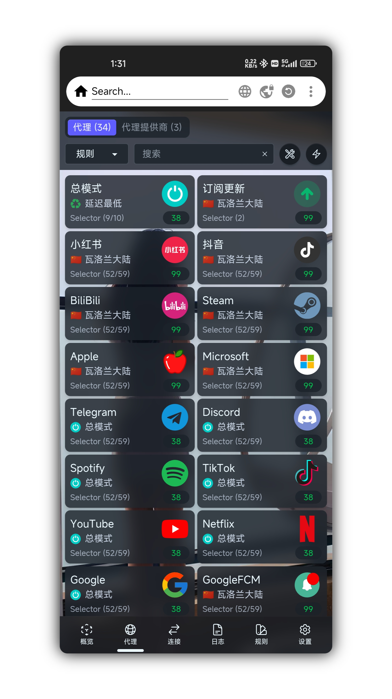

# Surfing

<h1 align="center">
  
  <br>BOXMETA<br>
</h1>

<h3 align="center">Magisk, Kernelsu, APatch</h3>

<div align="center">
    <a href="https://github.com/MoGuangYu/Surfing/releases/tag/Prerelease-Alpha">
        
    </a>
    <a href="https://github.com/MoGuangYu/Surfing/releases">
    
</a>
</div>
<br>
<div align="center">
    <strong>English</strong> | <a href="./README_CN.md">简体中文</a>
</div>

---

This project is a [Magisk](https://github.com/topjohnwu/Magisk), [Kernelsu](https://github.com/tiann/KernelSU), [APatch](https://github.com/bmax121/APatch) module for Clash/mihomo, sing-box, v2ray, xray, hysteria. It supports REDIRECT (TCP only), TPROXY (TCP + UDP) transparent proxy, TUN (TCP + UDP), and hybrid mode REDIRECT (TCP) + TUN (UDP) proxy.

Based on upstream integration for one-stop service, ready to use. Suitable for:
- Lazy people
- Beginners

The project's theme and configuration focus on [Clash/mihomo.Meta](https://github.com/MetaCubeX/Clash.Meta).

This module needs to be used in a Magisk/Kernelsu environment. If you don't know how to configure the required environment, you might need applications like ClashForAndroid, v2rayNG, surfboard, SagerNet, AnXray.

# Surfing User Declaration and Disclaimer

Welcome to use Surfing. Before using this project, please carefully read and understand the following statements and disclaimers. By using this project, you agree to accept the following terms and conditions. Hereinafter referred to as **Surfing**.

## Disclaimer

1. **This project is an open-source project for learning and research purposes only and does not provide any form of guarantee. Users must bear full responsibility for the risks and consequences of using this project.**

2. **This project is only for the convenience of simplifying the installation and configuration of Surfing for Clash services in the Android Magisk environment. It does not make any guarantees about the functionality and performance of Surfing. The developer of this project is not responsible for any problems or losses.**

3. **The use of this projects Surfing module may violate the laws and regulations of your region or the terms of service of service providers. You need to bear the risks of using this project on your own. The developer of this project is not responsible for your actions or the consequences of use.**

4. **The developer of this project is not responsible for any direct or indirect losses or damages resulting from the use of this project, including but not limited to data loss, device damage, service interruption, personal privacy leaks, etc.**

## Instructions for Use

1. **Before using the Surfing module, please make sure you have carefully read and understood the usage instructions and related documents of Clash and Magisk and comply with their rules and terms.**

2. **Before using this project, back up your device data and related settings to prevent unexpected situations. The developer of this project is not responsible for your data loss or damage.**

3. **Please comply with local laws and regulations and respect the legitimate rights and interests of other users when using this project. It is forbidden to use this project for illegal, abusive, or infringing activities.**

4. **If you encounter any problems or have any suggestions when using this project, you are welcome to provide feedback to the developer of this project, but the developer is not obligated to resolve issues or respond to feedback.**

Please decide whether to use the Surfing module only after clearly understanding and accepting the above statements and disclaimers. If you do not agree or cannot accept the above terms, please stop using this project immediately.

## Applicable Law

**During the use of this project, you must comply with the laws and regulations of your region. In case of any disputes, interpretation and resolution should be carried out in accordance with local laws and regulations.**

## Installation

- Download the module zip file from the [Release](https://github.com/MoGuangYu/Surfing/releases) page and install it via Magisk Manager, KernelSU Manager, or APatch.
- Version changes: [📲log](changelog.md)

## Uninstallation

- Uninstall the module from the Magisk Manager, Kernelsu Manager, or APatch application. [👉🏻Removal Command](https://github.com/MoGuangYu/Surfing/blob/main/uninstall.sh#L3-L4)

## Wiki

<details>
<summary>1. First Use</summary>

- After installing the module for the first time, **please first** add your subscription URL to `/data/adb/box_bll/clash/config.yaml`, and then manually restart the device once.
- Due to network reasons, the **rules**/**subscriptions** may not be fully downloaded automatically. Please manually refresh the panel.
  - If the above fails, ensure your network environment is normal.
- After the configuration and node fetching are complete, go to: 
- **Settings** → **Search Box**, and search for the keyword "DNS." If similar options appear, select them:
  - Private DNS
  - Dedicated DNS
- And configure the custom domain:
```text
1dot1dot1dot1.cloudflare-dns.com
```

- Web App:
  - It is purely a graphical tool for portable browsing and managing backend routing data, with no other unnecessary uses.
  - If you encounter a **connection failed** request or the proxy group icons are not displayed, you can try turning the network off/on, or check if you can access `raw.githubusercontent.com`.



> The module has an integrated GUI that can be accessed locally via a browser or online via the app. The two are essentially the same.

</details>

#

<details>
<summary>2. Controlling Operation</summary>  

- Can be controlled via **WiFi SSID** network toggling  
- Use the module switch to enable/disable the service in real time  
- Add a control switch to the system status bar
  


[Download Apk](https://www.coolapk.com/apk/com.coolapk.market) | [Copy URL](https://raw.githubusercontent.com/MoGuangYu/Surfing/main/folder/KJFSURL.md)


- Enter Settings


- Import URL


- Add a custom tile to the status bar

</details>

#

<details>
<summary>3. Routing Rules</summary>

GitHub Actions automatically builds at 6 AM Beijing Time every day to ensure the CN rules are up to date. [Wiki](https://github.com/MetaCubeX/meta-rules-dat)

> The routing rules are all linked online and automatically updated every 24 hours.

</details>

#

<details>
<summary>4. Subsequent Updates</summary>

- If you are using the default configuration, updates will be seamless.
- The module supports online updates in the client, and no restart is required after the update. The module switch control (enable/disable) ~~may temporarily fail and still require a restart~~, or you can use Toolbox for updates (not recommended, as script updates may not be timely).
- During updates, the configuration file will be backed up to:
   - `config.yaml.bak`
- User configuration will be backed up during the update to:
   - `box.config.bak`
- Your subscription URL will be automatically extracted and backed up to:
   - `subscribe_urls_backup.txt`
   - The backup will be automatically extracted and restored to the new configuration, suitable for those using the default configuration file.

- Module updates do not include:
   - Geo database files
   - Bin files
   - Web resources

> Ps: The update mainly follows upstream updates and delivers some configurations.

</details>

#

<details>
<summary>5. Usage Issues</summary>

1. Proxy Specific Applications (Black/Whitelist)
- To proxy all applications except certain ones, open the `/data/adb/box_bll/scripts/box.config` file, set the `proxy_mode` value to `blacklist` (default), and add elements to the `user_packages_list` array. The format for elements is `id:package_name`, separated by spaces. For example, `user_packages_list=("id:package_name" "id:package_name")` to **not proxy** specific Android user applications.

- To only proxy specific applications, open the `/data/adb/box_bll/scripts/box.config` file, set the `proxy_mode` value to `whitelist`, and add elements to the `user_packages_list` array. The format for elements is `id:package_name`, separated by spaces. For example, `user_packages_list=("id:package_name" "id:package_name")` to **only proxy** specific Android user applications.

Android user group ID identifiers:

| Standard User | ID  |
| ------------- | --- |
| Owner         |  0  |
| Second Space  |  10 |
| App Clone     | 999 |

> Typically, you can find all user group IDs and application package names in `/data/user/`. Do not use fake-ip mode when using black/whitelist.

2. Tun Mode
- ~~Enabled by default~~
- Deprecated in v7.4.3

> If necessary, you can manually enable it. Please do not use the whitelist/blacklist before using this mode.

3. Routing Rules
- Designed for mainland China usage
- Sufficient for most daily needs

> If there are no strict requirements, the whitelist/blacklist is not very meaningful, and the default configuration of the module is enough.

4. Panel Management
- Magisk Font Module

> May affect normal display of page fonts.

5. LAN Sharing
- Enable hotspot to allow other devices to connect.

> If other devices need to access the console backend, just use (http://Current WiFi Gateway:9090/ui).

6. Private DNS
- **When enabled**, please **ensure the module service is running properly**, **otherwise**, it may affect CN resolution and result in **no internet connection**.
- This is an optional feature ✅
- It is recommended to enable it.

> This is to fully solve some IPv6 DNS request leaks under Wan0.

7. Host File
- No need to mount
   - Just delete the file.
- To remount
   - Create a new file in the `etc` folder.
- All modifications take effect immediately.

> Domain IP redirection.

</details>

---

<a href="./LICENSE">
    
</a>

## Acknowledgments

<a href="https://github.com/CHIZI-0618">
  <p align="center">
    
    <br>
    <strong>CHIZI-0618</strong>
  </p>
</a>

<div align="center">
  <a href="https://github.com/MetaCubeX"><strong>MetaCubeX</strong></a>
</div>

<div align="center">
  <a href="https://github.com/Loyalsoldier"><strong>Loyalsoldier</strong></a>
</div>
<div align="center">
  <p> > Thanks for providing valuable foundation for the implementation of this project. < </p>
</div>
